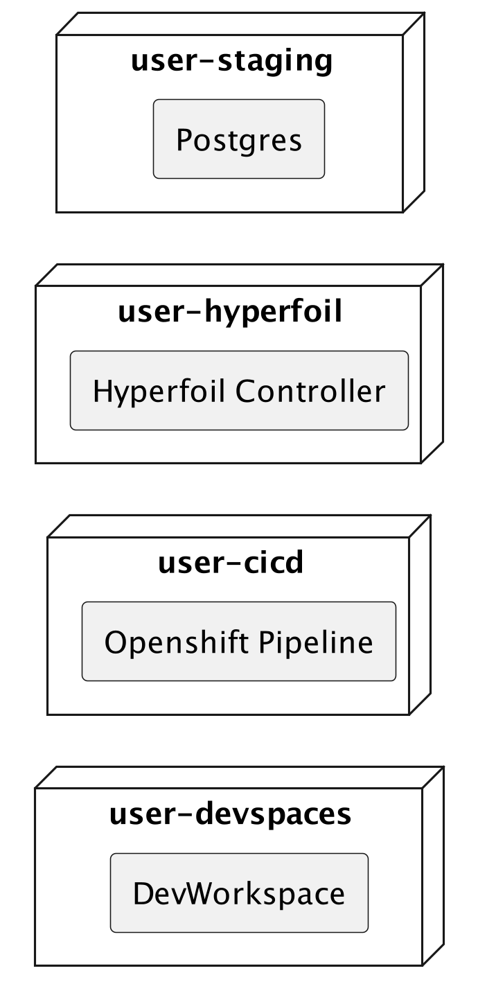
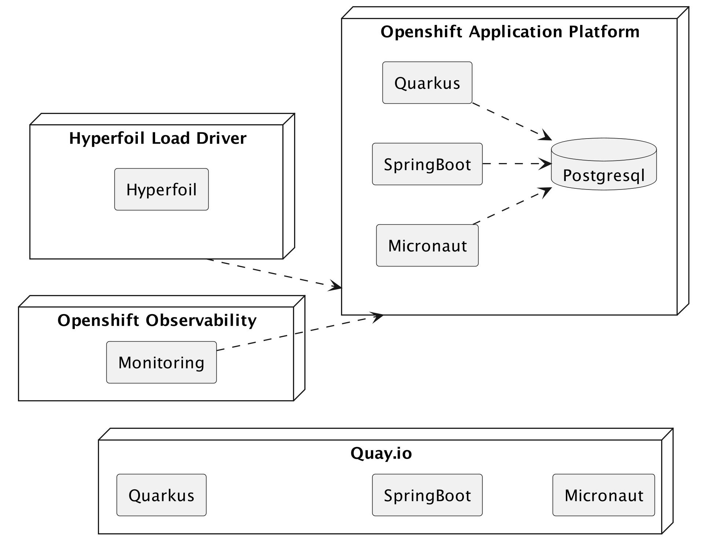

:guid: %guid%
:user: %user%
:markup-in-source: verbatim,attributes,quotes
:source-highlighter: highlight.js

= Modern Cloud-native Java runtimes performance monitoring on Red Hat Openshift

== Welcome
During this workshop attendees will have the opportunity to participate in a hands-on Lab, 
introductory-level session, focused on performance monitoring using different Modern cloud-native Java runtimes. 
Throughout the session, participants will execute tasks such as build, test and deploy microservices using link:https://quarkus.io[Quarkus^], link:https://spring.io[Spring Boot(R)^], and link:https://micronaut.io[Micronaut(R)^], 
on top of link:https://www.redhat.com/en/technologies/cloud-computing/openshift[Red Hat(R) OpenShift(R)^] Application Platform, and run load testing scenarios while monitoring the application performance. 
Specifically, attendees will analyze CPU load and memory usage, establish a baseline, and then observe the impact of scaling up application containers.

This workshop runs in a shared Openshift Cluster hosted on a Red Hat lab environment, but can be easily reproduced in any OpenShift cluster.

What you are going to do:

* Create your own GitHub Repo based on a GitHub Template
* Develop one microservice that consumes CPU and memory with Quarkus, another one with Spring Boot and Micronaut
* Compile, package and containerize these microservices
* Run these microservices locally on your own Dev Workspace using Red Hat link:https://developers.redhat.com/products/openshift-dev-spaces/overview[Openshift DevSpaces^]
* Build a immutable container image for your application using Openshift Pipelines (based on link:https://tekton.dev[Tekton^])
* Deploy your containers to a staging namespace created on Openshift
* Execute and monitor the microservices using different performance parameters
* Load test the microservices
* Analyze CPU load and scale containers appropriately
* Analyze memory and scale containers appropriately
* And much more!

Are you ready to get started? Proceed to the next step to learn more about your environment and get started with the workshop.

== Presenting the Workshop
This workshop is about understanding the performance of Java runtimes in a containerized environment in the cloud. It is a hands-on workshop, so you will be doing a lot of things in your development environment as well as on Red Hat Openshift.

Today, most of us containerize our Java applications and then deploy them to the cloud. 
But how do we know if our application is performing well? 
What do we do if we see a spike in CPU or memory usage? 
Do we scale out or scale up? 
Do we change the JVM parameters? Do we change the container size? 
And what about having native binaries and compiling our code with link:https://www.graalvm.org[GraalVM^]?

=== What Is This Workshop About?

To understand performance in a containerized environment we need a few simple algorithms that consume CPU and memory.
We will then develop these same algorithms in https://quarkus.io[Quarkus], https://spring.io/projects/spring-boot[Spring Boot] and https://micronaut.io[Micronaut], deploy them to link:https://www.redhat.com/en/technologies/cloud-computing/openshift[Red Hat(R) OpenShift(R)^] Application Platform and monitor their performance.

The algorithm consuming CPU will be a simple loop.
The higher the iteration, the more CPU it uses:

[source,java,role=copy]
----
        while (iterations > 0) {
            if (iterations % 20000 == 0) {
                try {
                    Thread.sleep(20);
                } catch (InterruptedException ie) {
                }
            }
            iterations--;
        }
----

The algorithm consuming memory will be a simple hashmap that we will fill with bites.
The more bits you have, the more memory it uses:

[source,java,indent=0]
----
        HashMap hunger = new HashMap<>();
        for (int i = 0; i < bites * 1024 * 1024; i += 8192) {
            byte[] bytes = new byte[8192];
            hunger.put(i, bytes);
            for (int j = 0; j < 8192; j++) {
                bytes[j] = '0';
            }
        }
----

=== What Will You Be Developing?

You will be developing 3 microservices, each doing the exact same thing (consuming CPU and memory), but using a different Java runtime: Quarkus, Spring Boot and Micronaut:

* A REST endpoint (used as an entry point) that will execute our CPU and memory consuming algorithms
* A repository used to store the results of the CPU and memory consuming algorithms
* A statistics entity mapped to the relational database

image::./imgs/module-1/welcome-develop.png[]

=== What Is Already Provided for You?

You will be working on a shared Openshift Cluster where each user has a set of four Projects (a.k.a Namespaces). 

 * `user-devspaces`: this namespace hosts your Developer Workspace where you will develop (inner-loop process) the applications using Openshift Devspaces.
 * `user-cicd`: this namespace hosts the Openshift Pipeline you will use to trigger the build and deploy (outer-loop process) of each application.
 * `user-hyperfoil`: this namespace hostw the Load Driver Controller used to generate load against the applications deployed on the staging environment.
 * `user-staging`: this is the namespace that will host the three applications you will build.

As a developer you will interact with the Openshift Platform using different tools to build, test, deploy and monitor your microservices.

=== What Will You Deploy?

Once developed and tested locally, you will build your microservices' container images and deploy them to Openshift Container Platform:

* You will create an Quay.io Registry Account to store and manage the Container Images
* You will run a Tekton Pipeline that:
  * builds each microservice into a container image;
  * pushes each application container image to your Quay.io Registry account;
  * and finally deploys each one on a staging namespace created on Openshift;

=== Structure of the Workshop

You have this material in your hands, and you can now follow its step by step.
The structure of this workshop is as follows:

* `_Accessing your DevWorkspace_`:
In this section you will access your DevWorkspace that was pre-provisioned on Openshift DevSpaces.
* `_Developing the Quarkus Application_`:
In this section you will develop a microservice using Quarkus, test it and run it locally.
* `_Developing the Micronaut Application_`:
In this section you will develop a microservice using Micronaut.
* `_Developing the Spring Boot Application_`:
In this section you will develop a microservice using Spring Boot.
* _Setting Up the Quay.io Registry_:
This section requires you to create a personal free account on link:https://quay.io[Quay.io^] - a Managed Container Registry Service hosted hosted by Red Hat.
* `_Deploying the Applications_`:
In this section you will set up a CI/CD pipeline using Opensift Pipelines (based on Tekton) so that our application builds and deploy on an automated way.
The pipelines uses various Tekton Tasks that uses popular opensource tools like Git, Apache Maven, Buildah, Skopeo and Knative CLI.
* `_Load Testing, Scaling and Monitoring the Applications_`:
In this section you will add some load to your microservices, monitor them, scale them, check the logs, etc.
* `_Going Native_`:
In this section you will compile your microservices with GraalVM (optional), package them, deploy them on Openshift, and see how it impacts the performance.

== Presenting Red Hat Openshift

Red Hat(R) OpenShift(R) is a unified platform to build, modernize, and deploy applications at scale. 
It integrates tested and trusted services to reduce the friction of developing, deploying, running, and managing applications in Kubernetes.

For this workshop we'll use the following services and capabilities available in the Platform:

* `Openshift Container Platform`: a unified platform to build, modernize, and deploy applications at scale.
* `Red Hat Quay.io`: A private container registry to store our Container images.
* `Openshift Pipelines`: A cloud-native, continuous integration and continuous delivery (CI/CD) solution based on Kubernetes resources and backed by Tekton.
* `Openshift DevSpaces`: the OpenShift-native developer workspace server and IDE based on the open link:https://www.eclipse.org/che/[Eclipse Che project^]
* `OpenShift Serverless`: Based on Knative
* `OpenShift Monitoring`: Based on Prometheus
* `OpenShift Logging`: Based on Loki
* `Crunchy Postgres for Kubernetes`: A Postgres certified Operator from link:https://www.crunchydata.com[Crunchy Data^]. It gives you a declarative Postgres solution that automatically manages your PostgreSQL clusters on Openshift/Kubernetes.

=== What's Openshift Application Platform?

A good marketing consise description os Openshift as an Application Patform...

image::./imgs/azure-compute-services.png[Diagram showing the different compute resources on Azure]

bla bla bla

image::./imgs/azure-container-apps.png[Diagram showing the architecture of Azure Container Apps]

Among many other capabilities Openshift Application Platform has the following features for developing Modern Cloud Native Apps:

- `_Revisions_`: Automatic versioning that helps to manage the application lifecycle of your container apps
- `_Traffic control_`: Split incoming HTTP traffic across multiple revisions for Blue/Green deployments and A/B testing
- `_Ingress_`: simple HTTPS ingress routes configuration, without the need to worry about DNS and certificates
- `_Autoscaling_`: leverage Knative-POD-Autoscaling (KPA) and Horizontal-POD-Autoscaling (HPA) supported scale triggers to scale your app based concurrency, cpu and memory 
- `_Monitoring_`: the standard output and error streams are automatically aggregated by the Platform Logging Stack (Loki and Vector)

image::./imgs/aca-environment.png[Diagram showing the environment concept in Azure Container Apps]
