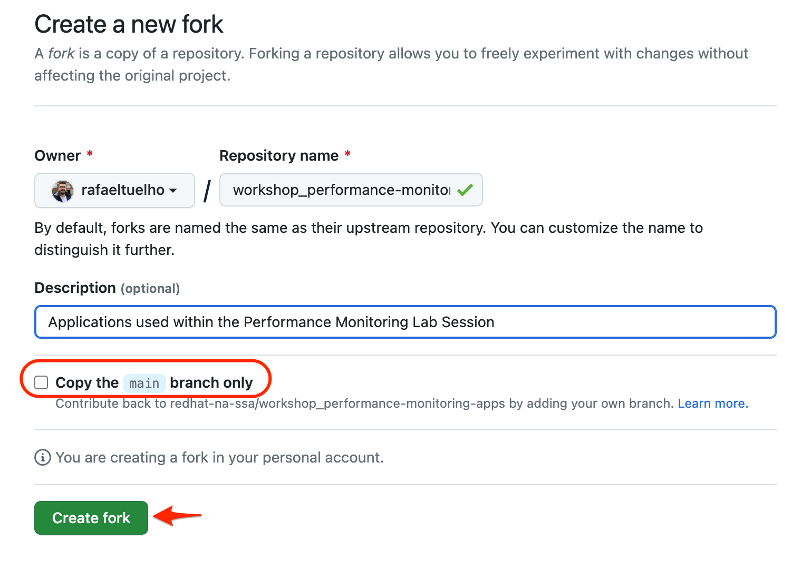
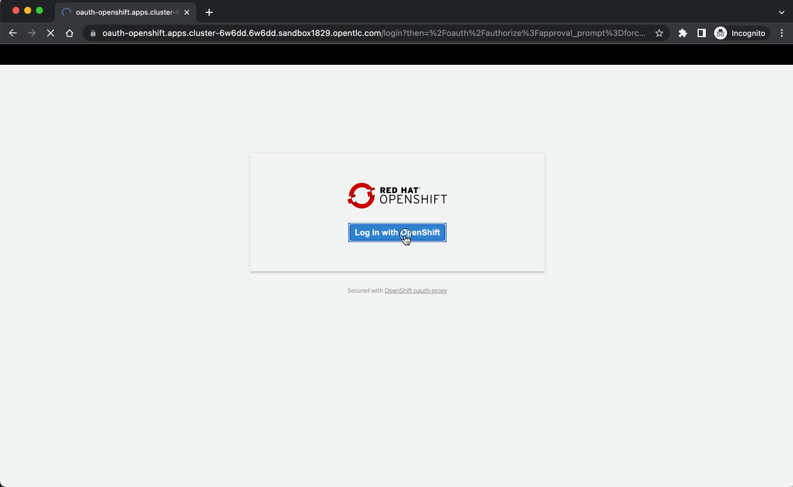
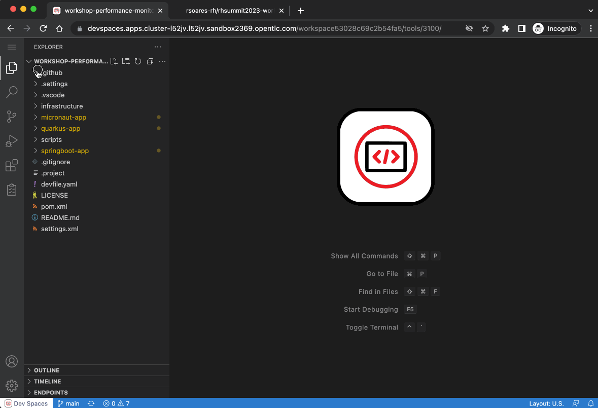

:guid: %guid%
:user: %user%

:openshift_user_password: %password%
:openshift_console_url: %openshift_console_url%
:user_devworkspace_dashboard_url: https://devspaces.%openshift_cluster_ingress_domain%
:user_devworkspace_url: https://devspaces.%openshift_cluster_ingress_domain%/dashboard/#/ide/%user%-devspaces/workshop-performance-monitoring-apps
:template-github-url: https://github.com/redhat-na-ssa/workshop_performance-monitoring-apps/fork
:hyperfoil_web_cli_url: https://hyperfoil-instance-%user%-hyperfoil.%openshift_cluster_ingress_domain%

:sectlinks:
:sectanchors:
:markup-in-source: verbatim,attributes,quotes

[[setup-project]]
= Getting ready for the Lab

== #`%user%`# | Prerequisites

Before starting our Lab, you need to set up a few prerequisites.
This includes:

* a Github account (you can quickly link:https://github.com/signup[*sign up for a new one*^] if you don't have yet)
* a Quay.io account (you can quickly link:https://quay.io/signin[*sign up for a new one*^] if you don't have yet)

[NOTE]
====
Both services are public and offer free accounts, which we will be leveraging throughout this lab. 

 * Github is a popular SCM Git repository service.
 * Red Hat Quay is a private container registry service hosted by Red Hat.
====

== Accessing your Lab Environment

Here are the information you will be using throughout this Lab session.

* *OpenShift Web Console:* {openshift_console_url}
 ** *Access Credentials:*
  *** #*Username:* `{user}`#
  *** #*Password:* `{openshift_user_password}`#
* link:{user_devworkspace_dashboard_url}[*OpenShift DevSpaces Workspace*]
* link:{hyperfoil_web_cli_url}[*Hyperfoil Web CLI*]

[IMPORTANT]
====
**Please, if you have any issue accessing any of the resources during the lab, don't hesitate to ask any of the lab assistants or instructors for help!**
====

== Forking the Workshop project on GitHub

Fork this link:{template-github-url}[project repository,window=_blank], into your own GitHub account.

[IMPORTANT]
====
**#Before clicking `Create Fork` button uncheck the 'Copy the main branch only' field!#**
====

Once the repository is forked into your account, copy its URL so we can use it in the next step.

Click the **Code** button, then copy your repository url.

image::./imgs/module-2/github-clone.png[Screenshot of GitHub showing the repository URL,440,280,align=center]

== Creating your DevWorkspace in Openshift DevSpaces

*OpenShift DevSpaces* allows you to have an instant cloud-based dev environment already prepared for this workshop.

Create your own *DevWorkspace* using the link:{user_devworkspace_dashboard_url}[*Devspaces Dashboard*]. Use your assigned Openshift user credentials to login for the first time. Then paste your forked git repo (https) URL into the `Git Repo URL` field and click *Create & Open* button.

image:./imgs/module-2/devspaces-dashboard.jpg[Opeshift DevSpaces Dashboard]

Devspaces will clone your git repo, search for the `devfile` manifest at the root of the project repo and start creating your DevWorkspaces.

[IMPORTANT]
====
At this moment Devspaces will prompt you to authenticate using your Github personal account.
====

See the DevWorkspace creation happening for the first time bellow.

// image:https://img.shields.io/static/v1?label=Open+My+DevWorkspace&message=Openshift+DevSpaces&color=EE0000&style=for-the-badge&logo=redhatopenshift[link={user_devworkspace_dashboard_url},title=Click to open your DevWorkspace on Openshift]

Wait for a few seconds until it gets fully initialized (it can take a few minutes for the first time). When it's ready, you should see a VSCode IDE in your browser! It's the same VSCode you may already be familiar with.

[IMPORTANT]
====
During this first initialization VSCode will install some extensions (Java, Quarkus, Microprofile) and start the Java Language Server.
Please, watch out for a few pop-ups that may appear at the bottom right of the IDE.

 * `Do you trust the authors of the files in this Folder?` banner. Mark the checkbox and click the *Yes* button.
 * `Tools for Microprofile...`. Click *Yes* button
 * `Opening Java Projects...`. Click *'check details'* just to check the Java Language Server initialization. Then you can close the terminal.
====

Now you should be good to start coding!

== Initial Maven build
Using the IDE terminal, build the projects using Maven. You can open new VSCode Terminal by using `'Ctrl + \`'` shortcut or using the main menu as shown bellow.

Then just execute:

[source,shell,role=copy]
----
mvn install -DskipTests
----

You should see an output similar to this:

[source,shell]
----
[INFO] ------------------------------------------------------------------------
[INFO] Reactor Summary for Modern Cloud-native Java runtimes performance monitoring on Red Hat Openshift! 1.0.0-SNAPSHOT:
[INFO] 
[INFO] Modern Cloud-native Java runtimes performance monitoring on Red Hat Openshift! SUCCESS [  0.015 s]
[INFO] Modern Cloud-native Java runtimes performance monitoring on Red Hat Openshift :: Micronaut SUCCESS [  5.301 s]
[INFO] Modern Cloud-native Java runtimes performance monitoring on Red Hat Openshift :: SpringBoot SUCCESS [  0.820 s]
[INFO] Modern Cloud-native Java runtimes performance monitoring on Red Hat Openshift :: Quarkus SUCCESS [  6.738 s]
[INFO] ------------------------------------------------------------------------
[INFO] BUILD SUCCESS
[INFO] ------------------------------------------------------------------------
[INFO] Total time:  15.121 s
[INFO] Finished at: 2023-05-03T20:27:25Z
[INFO] ------------------------------------------------------------------------
----

[NOTE]
====
Your workspace comes with all the tools you may need as a Java Developer to perform the dev inner-loop tasks (code, test, debug, change, etc).
Everything you use (tools and commands) in this workspace is defined using the *Devfile* standard -  a declarative open standard that uses `YAML` manifest to define your dev workspace stack.

Check link:https://devfile.io[Devfile.io] for more details.
====

== Checking your OpenShift login

#Before we move on let's check one more thing inside DevWorkspace.#

Using the Terminal (`'Ctrl + \`'` to open it) execute the following command to check if your user is properly logged in the Openshift Cluster:

[source, shell, role=copy]
----
oc whoami
----

If you see your assigned username: `%user%`, you are good to go! 

Otherwise, if you see something like: `system:serviceaccount:%user%-devspaces:workspacexxxxxxxxx-sa`, please do this:

1. Open the *Task Manager* and execute the *Task* named `98: OC Login`
2. Enter your assigned user password: `%password%`

.*Click to see how to use the IDE Task Manager*
[%collapsible]
====
image::./imgs/troubleshooting/VSCode_task_manager_oc_login.gif[OC Login Task]
====

Now that you have your development environment setup and you can build the initial code, let's develop our three microservices.
