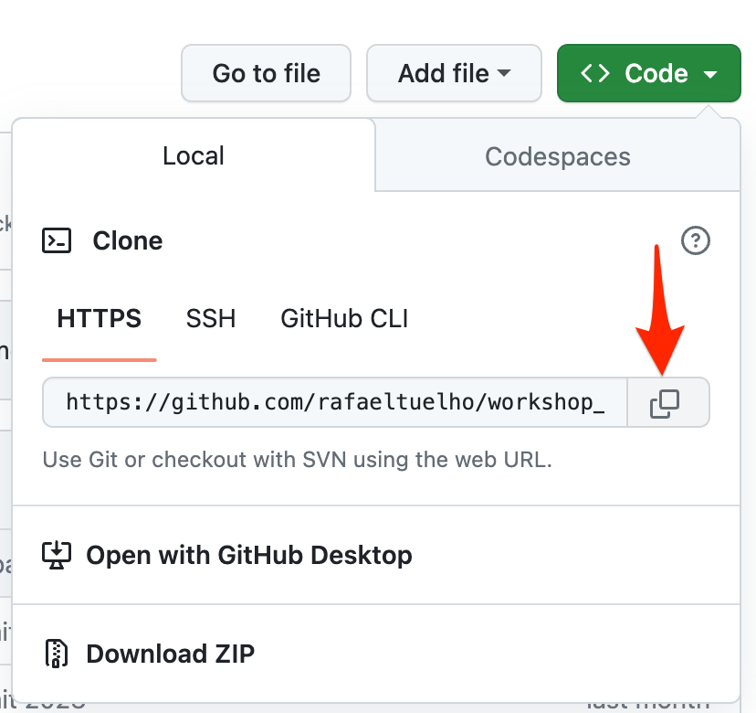

:guid: %guid%
:user: %user%
:openshift_console_url: %openshift_console_url%
:user_devworkspace_url: %user_devworkspace_url%
:markup-in-source: verbatim,attributes,quotes

[[setup-project]]
= Setting Up the Project

Before starting the development, you need to set up the project.
This includes:

* Creating a new project on GitHub based on an existing GitHub template
* Accessing your Openshift DevWorkspace (already provisioned for you in the Lab Cluster).

== Using the GitHub Template

Open {template-github-url}[this GitHub repository,window=_blank], click on `Use this template` then `Create a new repository`.

image::./imgs/module-2/github-template.png[Screenshot of GitHub showing the "Use this template" button]

You will be redirected to the repository creation page.
Select the owner of the repository, enter a name for your new repository (eg.
`rhsummit2023-workshop-performance-monitoring`), set the repo visibility to `public` and click on `Create repository from template`.

Once the repository is created, copy its URL so we can use it in the next step.

Click the **Code** button, then copy your repository url.

== Opening Up Your DevWorkspace in OpenshiftDevSpaces

link:https://developers.redhat.com/products/openshift-dev-spaces/overview[Openshift DevSpaces^] allows you to have an instant cloud-based dev environment already prepared for this workshop.

image:https://img.shields.io/static/v1?label=Open+My+DevWorkspace&message=Openshift+DevSpaces&color=EE0000&style=for-the-badge&logo=redhatopenshift[link={user_devworkspace_url},title=Click to open your DevWorkspace on Openshift]

When you first access your DevWorkspace you'll be prompted to Login. Use the same Openshift credentials provided to you at the top of this page.
After you login in you should see the your Workspace (named `workspace-performance-monitoring-apps`) initializing. Wait for a few seconds until it get started.
When its ready you should see a VSCode IDE in your browser! It's the same VSCode you may be already familiar with. 

[WARNING]
====
At first your workspace should take about 1min to fully initialize.
During this first initialization VSCode will install some extensions (Java, Quarkus, Microprofile) and start the Java Language Server.
====

image::./imgs/module-2/openshift-devspaces-first-access.gif[DevWorkspace initialization]

[IMPORTANT]
====
When you open your Workspace for the first time watch for two pop-ups that may appear at the bottom right of the IDE.

 * Tools for Microprofile... Click Yes button
 * Opening Java Projects... Click 'check details' just to check the Java Language Server initialization. Then you can close the terminal.

====

Accept the 'Trust Authors' prompt that appears at first.
image::./imgs/module-2/VSCode_Trust_Authors-pop-up.jpg[Screenshot of VSCode Trust Authors popup]

[TIP]
====
You can experiment Openshift Devspaces for 30 days by signing up for a Red Hat Developer Sandbox account, see link:https://developers.redhat.com/developer-sandbox[Red Hat Developer Sandbox].
====

== Configuring Git
Your workspace has already cloned the workshop template repo. But before you start making changes you need to point the `git remote` to your own fork.
To do that open a new `Terminal` panel and execute the following git command.

image::./imgs/module-2/VSCode_terminal_git_add_remote.gif[DevWorkspace initialization]

[TIP]
====
You can open new VSCode Terminal  by using `'Ctrl + \`'` (or `'command + \`'` on MacOS)
====

[source, shell, role=copy]
----
git remote set-url origin https://github.com/your-git-username/your-repo-name.git

git remote -v
----

Now you should be good to start coding!

== Building the Initial Project
Using the same Terminal build the projects using Maven (already present in your DevWorkspace):

[source,shell]
----
mvn install -DskipTests
----

You should see an output similar to this:

[source,shell]
----
[INFO] ------------------------------------------------------------------------
[INFO] Reactor Summary for Modern Cloud-native Java runtimes performance monitoring on Red Hat Openshift! 1.0.0-SNAPSHOT:
[INFO] 
[INFO] Modern Cloud-native Java runtimes performance monitoring on Red Hat Openshift! SUCCESS [  0.015 s]
[INFO] Modern Cloud-native Java runtimes performance monitoring on Red Hat Openshift :: Micronaut SUCCESS [  5.301 s]
[INFO] Modern Cloud-native Java runtimes performance monitoring on Red Hat Openshift :: SpringBoot SUCCESS [  0.820 s]
[INFO] Modern Cloud-native Java runtimes performance monitoring on Red Hat Openshift :: Quarkus SUCCESS [  6.738 s]
[INFO] ------------------------------------------------------------------------
[INFO] BUILD SUCCESS
[INFO] ------------------------------------------------------------------------
[INFO] Total time:  15.121 s
[INFO] Finished at: 2023-05-03T20:27:25Z
[INFO] ------------------------------------------------------------------------
----

[NOTE]
====
Your workspace comes with all the tools you may need as a Java Developer to perform the dev inner-loop tasks (code, test, debug, change, etc).
Everything you use (tools and commands) in this workspace is defined using the Devfile standard -  a declarative open standard that uses `YAML` manifest to define your dev workspace stack.

Check link:https://devfile.io[Devfile.io] for more details.
====

Now that you have your development environment setup and that you can build the initial code, let's develop our three microservices.
