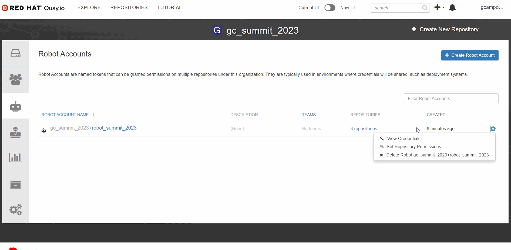
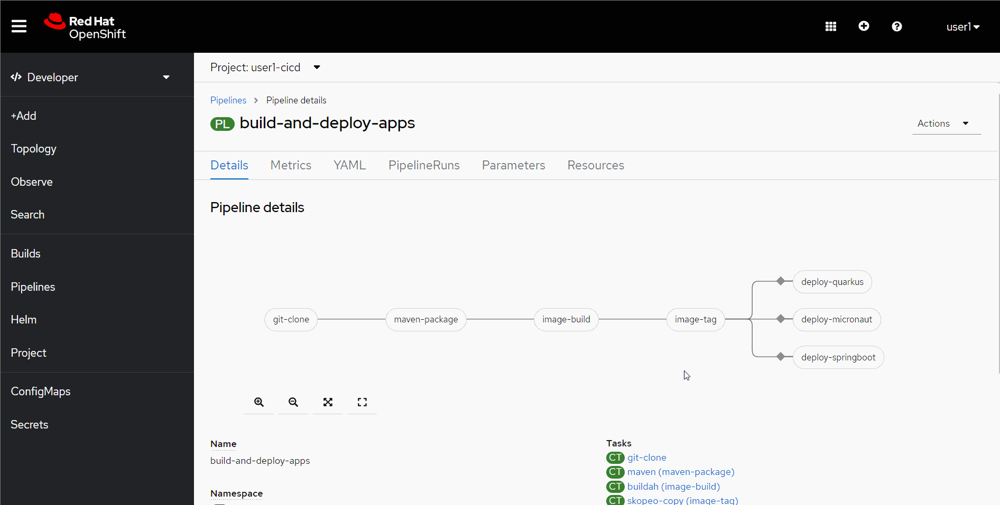

:markup-in-source: verbatim,attributes,quotes

== Introduction

In this module you'll learn how to deploy the Java applications using OpenShift Pipelines (based on https://tekton.dev/[Tekton]).

Tekton is a CI/CD tool made especifically to run in a Kubernetes environment. It takes advantage of containers and shared resources, such as https://kubernetes.io/docs/concepts/storage/volumes/[volumes], to create reproducible processes to facilitate the creation of automation https://tekton.dev/docs/pipelines/pipelines/[pipelines].

[NOTE]
====
Recommended reading: https://www.redhat.com/en/topics/devops/what-is-ci-cd#overview[What is CI/CD?]
====

You won't need to create your pipeline from scratch. To reduce the complexity, we already provisioned a pipeline for you in the `%user%-cicd` namespace. You just need to learn what it does and how to run it.

== Understanding the pipeline

Go to %openshift_console_url%/topology/ns/%user%-cicd?view=graph[%user%-cicd project]. Then, on the right side menu, click on *Pipelines*:

image::imgs/module-4/pipelines_view.png[Pipelines View]

if you click on the *build-and-deploy-apps* link, you'll be able to see the pipeline steps.

image::imgs/module-4/pipeline.png[Pipeline]

. Clone your source code from your fork.
. Build the Java code using Maven.
. Build and push the container image to Quay.io
. Tag the image as *latest*
. Deploy the application in your `staging` namespace.

[NOTE]
====
We'll use the same pipeline to deploy all the applications but we can only deploy one at a time.
====

== Configuring Quay access

You need to create the image repositories in your https://quay.io/repository/[Quay.io] account and create credentials for the pipeline to be able to push the image.

image::imgs/module-4/clean_org.png[new org]

You need to create 3 repositories in your account: 

* quay-app
* micronaut-app
* springboot-app

[NOTE]
====
To avoid problems, keep the same name for the repositories. Make sure they are public
====

image::imgs/module-4/create_repo.png[new repo]

Once the 3 repositories are created, you can create a robot account. This robot account needs write permissions for the repositories. 

Follow the steps in the following gif to set your robot account: 

image::imgs/module-4/robot_account.gif[create robot]

Once the robot is created, you can get the secret you need to authenticate the pipeline.

With the kubernetes secret on your copyboard, you can paste it on OpenShift console, edit it's name to `quay-secret` and set the *namespace* to  `%user%-cicd`, like in the gif:

image::imgs/module-4/create_secret.gif[Create secret]

Before running the pipeline you need to link the secret you just created to the https://kubernetes.io/docs/concepts/security/service-accounts/[Service Account] used by the pipeline.

Go to your %devspace_url%[DevWorkspace] and run the task that links the secret:

image::imgs/module-4/link_secret.gif[Link secret]

== Running the pipeline

Go back to the pipeline view. Click on `Actions`, then click on `Start`.

Fill the mandatory parameters following the instructions on each box. 

For the Workspaces section, select:

* *shared-workspace*: PersistenceVolumeClaim > `shared-workspace-pvc`
* *maven-settings*: Empty Directory
* *img-urls-cm*: Empty Directory

Click on `start` and wait for the pipeline to finish it's process.

image::imgs/module-4/workspaces.png[Workspace values]

Once the pipeline finished succesfully, all tasks on it will be green as in the following image:

image::imgs/module-4/pipeline_finished.png[Pipeline finshed]

== Checking the deployment

Since we're deployment serverless applications, after the initial test of the https://knative.dev/docs/concepts/serving-resources/revisions/[revision], if there is no requests, the application will scale down to zero.
To test if the deployment was successful, you can make a request to the application using the external https://docs.openshift.com/container-platform/4.12/networking/routes/route-configuration.html[route] created for it.

Using the OpenShift console, go to the `staging` project. In the topology view, click on the arrow icon in the quarkus application box:

image::imgs/module-4/app_running.png[App running]

You should be able to visualize the Quarkus application home page, just like in the image:

image::imgs/module-4/quarkus_home.png[Quarkus Home]