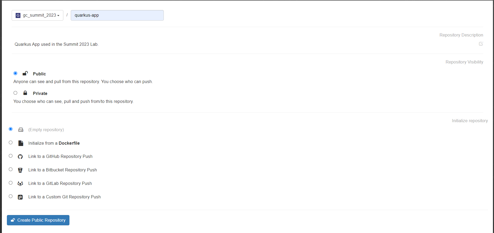
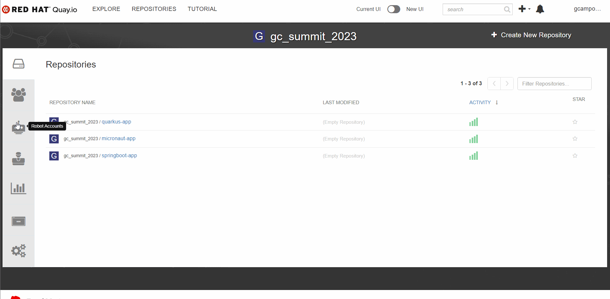

:markup-in-source: verbatim,attributes,quotes

== Deploying the Microservices 

In this module you'll learn how to deploy the Java applications using OpenShift Pipelines (based on https://tekton.dev/[Tekton]).

Tekton is a CI/CD tool made especifically to run in a Kubernetes environment. It takes advantage of containers and shared resources, such as https://kubernetes.io/docs/concepts/storage/volumes/[volumes], to create reproducible processes to facilitate the creation of automation https://tekton.dev/docs/pipelines/pipelines/[pipelines].

Recommended reading: https://www.redhat.com/en/topics/devops/what-is-ci-cd#overview[What is CI/CD?]

You won't need to create your pipeline from scratch. To reduce the complexity, we already provisioned a pipeline for you in the `userx-cicd` namespace. You just need to learn what it does and how to run it.

=== Understanding the pipeline

In the *Developer view*, select the `userx-cicd` project. Then, on the right side menu, click on *Pipelines*.

image::imgs/module-4/pipelines-view.png[Pipelines View]

if you click on the *build-and-deploy-apps* link, you'll be able to see the pipeline steps.

image::imgs/module-4/pipeline.png[Pipeline]

. Clone your source code from your fork.
. Build the Java code using Maven.
. Build and push the container image to Quay.io
. Tag the image as *latest*
. Deploy the application in your `staging` namespace.

[NOTE]
====
We'll use the same pipeline to deploy all the applications but we can only deploy one at a time.
====

=== Configuring Quay 

You need to create the application repos in your Quay.io account and create credentials for the pipeline to be able to push the image.

[NOTE]
====
You may create an organization in your account just for this lab, just like in the following example
====

image::imgs/module-4/clean-org.png[new org]

You need to create 3 repos: 

* quay-app
* micronaut-app
* springboot-app

[NOTE]
====
To avoid problems, keep the same name for the repos. Make sure they are public
====

Once the 3 repositories are created, we can create a robot account. You can follow the steps in the following gif: 

Once the robot is created, we can get the secret we need to authenticate the pipeline.

