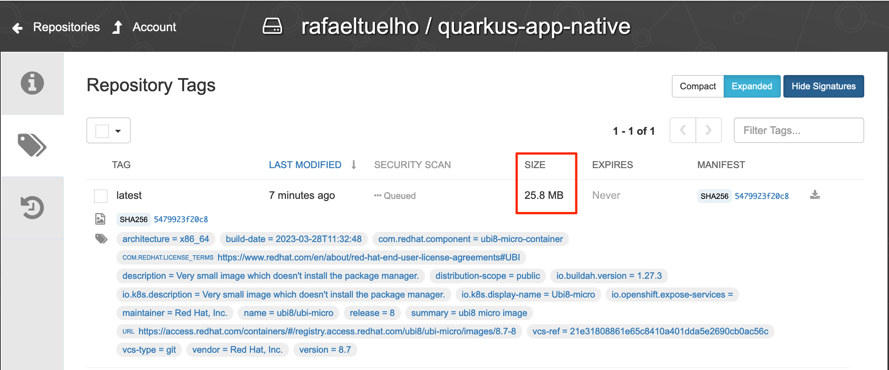

:guid: %guid%
:user: %user%

:openshift_user_password: %password%
:openshift_console_url: %openshift_console_url%
:user_devworkspace_url: https://devspaces.%openshift_cluster_ingress_domain%
:hyperfoil_web_cli_url: https://%user%-hyperfoil.%openshift_cluster_ingress_domain%
:hyperfoil_web_cli_url_auth_creds: https://%user%:%password%@%user%-hyperfoil.%openshift_cluster_ingress_domain%
:hyperfoil_benchmark_definition_url: https://raw.githubusercontent.com/redhat-na-ssa/workshop_performance-monitoring-apps-template/main/scripts/hyperfoil/summit-load-apps.hf.yaml
:grafana_url: https://grafana-route-grafana.%openshift_cluster_ingress_domain%
:pgadmin_url: https://pgadmin-%user%-staging.%openshift_cluster_ingress_domain%

:markup-in-source: verbatim,attributes,quotes

= Going Native

In this section you will:

* Learn what GraalVM is, and what is a native build
* Build a GraalVM native image of the Quarkus application (optional), and deploy it
* Build a GraalVM native image of the Micronaut application (Optional), and deploy it
* Build a GraalVM native image of the Spring Boot application (Optional), and deploy it

The 3 native image builds are extremely similar, so don't be surprised if there is some repetition in the instructions.

== What is GraalVM

GraalVM is a new technology, allowing to create a native build of a Java application:
your application will be compiled to a native executable, and will not need a JVM to run.
That executable will be specific to your operating system, and will start much faster than with a JVM.

You can find more information on GraalVM at https://www.graalvm.org/[https://www.graalvm.org/]. 

[NOTE]
====
Red Hat provides downstream release of GraalVM called link:https://github.com/graalvm/mandrel[*Mandrel*], focused on native image compilation of *Java applications in Red Hat-backed projects*. As such, it is not a GraalVM native-image replacement for all users. For instance, Mandrel does not ship with polyglot or LLVM toolchain support, which some use cases might require. However, Red Hat engineers contribute to upstream GraalVM and work hard to stay up-to-date with upstream GraalVM code. 
For more details on Mandrel distribution and its use on Java Application (using Quarkus) checkout link:https://developers.redhat.com/blog/2021/04/14/mandrel-a-specialized-distribution-of-graalvm-for-quarkus[this article].
====

Because native image builds are OS specific and we want our native-executable to run on Linux based Containers (more specifically using link:https://www.redhat.com/en/blog/introducing-red-hat-universal-base-image[the Red Hat UBI base image]), we need a Linux environment to build our them.
This time we will leverage GitHub Actions that is available right from your repo in your github account.

[NOTE]
====
Because native builds are much slower than JVM builds and are resource intensive (cpu and mem) we won't execute them in this Lab. 
There are guides showing how you can setup a GraalVM environment to create a native-executable for each of the modern cloud-native java runtimes
we've been using in this Lab. For instance if you are interested in know how to create a native-executable for your Quarkus App link:https://quarkus.io/guides/building-native-image[checkout this guide in  Quarkus.io.]
====

== Building native image using Github Actions

To build native images of our 3 microservices, we will use a pre-configured *GitHub Action workflow* already created for you inside your git repo.
There three workflow definitions inside `$PROJECT_SOURCE/.github/workflows`:

image::../imgs/module-5/github_actions_workflow_files.png[Github Action workflow definitions,440,280]

Each one can be used to manually trigger its respective application native image build using Github infrastructure. 
For instance, lets trigger the workflow to build a native image for our Quarkus app.

1. from your github account, open our repo and open the `Actions` tab
2. in the left menu select the workflow `Build Quarkus native container image`
3. then at the far right click the `Run workflow` button.
4. fill in the fields:
 ** `Container Registry Organization/Account name`: should be your personal quay.io account name
 ** `Container Registry Username`: should be your personal quay.io account name (*or a robot account name*)
 ** `Container Registry User token`: your quay.io user password (*or a robot password/token*)
5. finally, click `Run workflow`

.Click to see how to run a Github action workflow
[%collapsible]
====
image::../imgs/module-5/github_action_native_build_trigger.gif[Github Action to build native images for our applications]
====

The workflow run should take about *8min or less*. If it succeeds (your entered the right registry credentials) you should have a new image pushed to your Quay.io.

[WARNING]
====
Due to our Lab session time constraint, we already built the three app native images and made it available for you in our Quay.io.
This way you can skip this Github Action build step got to the next section to update your service's deployment pointing to our registry.

native images ready to use:

```
quay.io/redhat_na_ssa/quarkus-app-native
quay.io/redhat_na_ssa/micronaut-app-native
quay.io/redhat_na_ssa/springboot-app-native
```

====

Notice the size of our native container image! Compare it with the JVM based image.
Now, how about the resource consumption at runtime? To find that out lets update our apps' deployment and run some load tests to observe how it behaves compared to its JVM version...



=== Updating our application deployments to use the native container image
Because ou apps are deployed as Serverless workload (based on Knative Serving) we'll be using the Knative CLI (`kn`) to update them.

==== Updating the Quarkus service
To update the Quarkus app deployment open a Terminal in your DevWorkspace and run this command.

[source, shell, role=copy]
----
kn service update quarkus-app \
  --image quay.io/redhat_na_ssa/quarkus-app-native \
  --probe-liveness-opts='initialDelaySeconds=1' \
  --probe-readiness-opts='initialDelaySeconds=1' \
  --limit=cpu=1,memory=700Mi \
  --scale=0..5 \
  -n %user%-staging
----

==== Updating the Micronaut service
To update the Quarkus app deployment open a Terminal in your DevWorkspace and run this command.

[source, shell, role=copy]
----
kn service update micronaut-app \
  --image quay.io/redhat_na_ssa/micronaut-app-native \
  --probe-liveness-opts='initialDelaySeconds=1' \
  --probe-readiness-opts='initialDelaySeconds=1' \
  --limit=cpu=1,memory=700Mi \
  --scale=0..5 \
  -n %user%-staging
----

==== Updating the Springboot service
To update the Springboot app deployment open a Terminal in your DevWorkspace and run this command.

[source, shell, role=copy]
----
kn service update springboot-app \
  --image quay.io/redhat_na_ssa/springboot-app-native \
  --probe-liveness-opts='initialDelaySeconds=1' \
  --probe-readiness-opts='initialDelaySeconds=1' \
  --limit=cpu=1,memory=700Mi \
  --scale=0..5 \
  -n %user%-staging
----

== Load Testing the Native Images

After all your native images are built and deployed, let's run our load tests again.

Open the link:{hyperfoil_web_cli_url_auth_creds}[Hyperfoil Web CLI^] and start new Test runs as described in the load testing section.

== Monitoring the Native Images

Once the load tests are done, let's take a look at the results using link:{grafana_url}[Grafana].

You should now see the results of the load tests for the native images, and you can compare them to the previous results of the JVM images.

image::../assets/java-runtimes-dashboard-native.png[Screenshot of the Java Runtimes dashboard with JVM vs native tests]